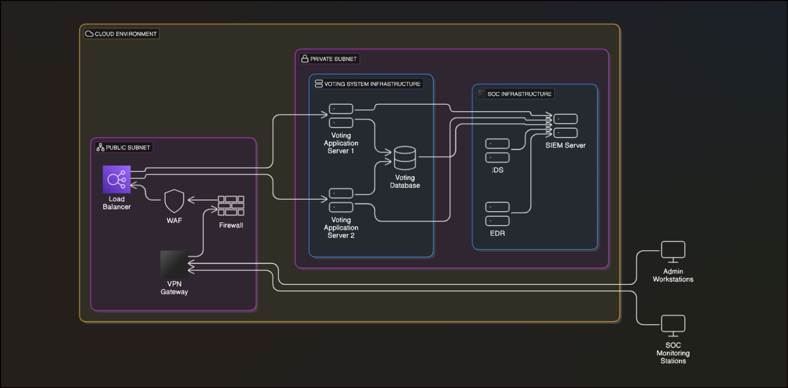

# SOC Architecture for Academy Awards Voting Process (Fictitious Use Case)

This project demonstrates a fictitious setup of a Security Operations Center (SOC) architecture for securing the Academy Awards voting process. The aim of this project is to showcase cybersecurity knowledge in designing, deploying, and managing a secure infrastructure for a high-profile, time-sensitive event. **This is purely a fictional use case and not affiliated with the actual Academy Awards.**

## Project Overview

In this project, we simulate the architecture required to monitor and protect a voting environment for the Academy Awards. The voting system is designed with a focus on confidentiality, integrity, and availability, ensuring that the voting process remains secure and resilient against potential threats. 

The SOC architecture includes key components such as a Virtual Private Cloud (VPC), Intrusion Detection Systems (IDS), Endpoint Detection and Response (EDR) solutions, and a SIEM system to aggregate and analyze logs. The infrastructure is defined using Infrastructure as Code (IaC) principles, with Terraform, Ansible, and Docker configurations to simplify deployment and management.

**Disclaimer:** This repository is for demonstration and learning purposes only, and no real voting data or production environment is involved.

## Architecture Diagram



The above architecture diagram represents the core components of the SOC setup, including network segmentation, monitoring systems, secure access controls, and logging.

## Components

- **VPC (Virtual Private Cloud):** Isolated environment to host the voting system components.
- **SIEM Server:** Aggregates logs and monitors for suspicious activities (e.g., ELK Stack).
- **IDS (Intrusion Detection System):** Monitors network traffic for threats (e.g., Suricata).
- **EDR (Endpoint Detection and Response):** Provides real-time endpoint protection.
- **Firewall and Security Groups:** Control access and enforce network segmentation.
- **VPN Gateway:** Allows secure access for SOC administrators.

## Prerequisites

To set up and deploy this architecture, you will need the following:
- **Git** for version control
- **Terraform** for Infrastructure as Code (IaC)
- **Ansible** for configuration management
- **Docker** and **Docker Compose** for containerized applications (SIEM, IDS)
- **AWS CLI** or similar for cloud provider access (assuming AWS for this example)

## Setup Instructions

### 1. Clone the Repository
```bash
git clone https://github.com/YOUR_USERNAME/SOC-architecture-for-Entertainment-awards.git
cd SOC-architecture-for-Entertainment-awards
